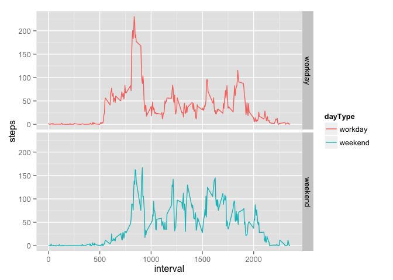

# Reproducible Research: Peer Assessment 1


## Loading and preprocessing the data

```r
#load data
activity <- read.csv("~/Rworkspace/Reproducible Research/activity.csv", stringsAsFactors = FALSE)
#convert date strings to date format
as.Date(activity$date,format="%Y-%m-%d") -> activity$date
# package needed in rendering this markdown
require("ggplot2")
```

```
## Loading required package: ggplot2
```

```
## Warning: package 'ggplot2' was built under R version 3.1.3
```

## What is mean total number of steps taken per day?

```r
#aggregated number of steps per day
stepsPerDay <- aggregate(steps ~ date, data = activity, sum)
#plot a historgrammmm
ggplot(stepsPerDay) + aes(x = steps) + geom_histogram()
```

 

```r
#report mean and median
summary(stepsPerDay$steps)[c("Mean","Median")]
```

```
##   Mean Median 
##  10770  10760
```

## What is the average daily activity pattern?

```r
#aggregated number of steps per day
averageStepsPerIntervalAndDay<- aggregate(steps ~ interval, data = activity, mean)
#plot a hline
ggplot(averageStepsPerIntervalAndDay) + aes(x = interval, y = steps) + geom_line()
```

 

```r
#report mean and median
subset(averageStepsPerIntervalAndDay, steps==max(steps))
```

```
##     interval    steps
## 104      835 206.1698
```

## Imputing missing values

For missing number of steps values we will use the mean of the number of steps for that interval.


```r
#number of rows with missing values
summary(activity$steps)["NA's"]
```

```
## NA's 
## 2304
```

```r
#fill the na values of steps
activityNA <- activity[is.na(activity$steps),]
activityNA$steps <- averageStepsPerIntervalAndDay[match(activityNA$interval, averageStepsPerIntervalAndDay$interval), "steps"]
# create new df with filled missing values
newActivity <- activity
newActivity[is.na(newActivity$steps),] <- activityNA
#aggregated number of steps per day
stepsPerDay <- aggregate(steps ~ date, data = newActivity, sum)
#plot a historgrammmm
ggplot(stepsPerDay) + aes(x = steps) + geom_histogram()
```

 

```r
#report mean and median
summary(stepsPerDay$steps)[c("Mean","Median")]
```

```
##   Mean Median 
##  10770  10770
```

This does not change the mean but does change the median of the distribution. 

## Are there differences in activity patterns between weekdays and weekends?


```r
#factor variable in the dataset with two levels – “weekday” and “weekend”
dayType <- factor(x = weekdays(newActivity$date))
levels(dayType) <- c("workday","workday","weekend","weekend","workday","workday","workday")
newActivity$dayType <- dayType
#aggregated number of steps per day
averageStepsPerIntervalAndDay <- aggregate(steps ~ interval + dayType, data = newActivity, mean)
#plot a hline
ggplot(averageStepsPerIntervalAndDay) + aes(x = interval, y = steps, color= dayType) + geom_line() + facet_grid(dayType ~ .)
```

 

There is less of a spike in early morning activity, probably due to the fact that people dont have to get to work. The filling of the NAs may have distorted the data so really there is not wise to draw any conclusions from it really.
